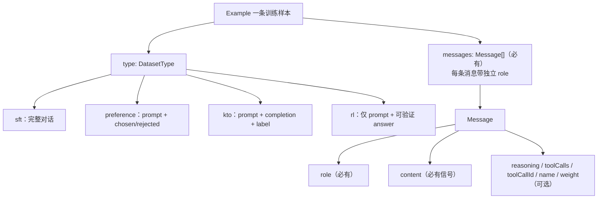

# DataForge 数据模型与消息角色规范

> 本文档说明 DataForge 的规范数据模型、五种消息角色的语义，以及"一条合法样本"的规则。
> 面向两类读者：**准备数据的人**读 §1-3（怎么合法地组织一条样本）；**改代码的开发者**读 §4-5（数据不变量在哪、改动会牵动哪里）。
> 唯一真相源是 `src/engine/types.ts`，本文档是它的语义补充，不重复架构与目录说明（见仓库根 `AGENTS.md`）。

**一句话**：规范模型以 `Example`（一条样本）为最小单位，`messages` 是它的对话消息列表，每条消息携带独立的 `role`；解析、存储、质检、导出全部围绕该模型展开。

---

## 1. 核心概念



- 一条样本 = 一个 `Example`；一个 `Example` 的 `messages` 里可以有**任意多条**消息，**每条消息的角色独立选择**。
- 数据写入走 `lib/mutations.ts`，读取走 `lib/hooks.ts`；创建样本用工厂 `createExample`（唯一必填参数：`projectId` 与 `messages`，其余字段有默认值，如 `type: 'sft'`、`split: 'train'`）。
- 五种角色：`system`、`developer`、`user`、`assistant`、`tool`。

---

## 2. 五种角色的语义与选择

| 角色 | 语义 | 位置惯例 | 可选字段 | 备注 |
|---|---|---|---|---|
| `system` | 全局系统指令：定义模型人设、行为约束 | 对话**开头**（可多条） | `name` | 所有模板家族都接受，但 **Gemma 无 system 角色**（导出时折叠进首条 user） |
| `developer` | 开发者指令（OpenAI o 系列推理模型引入） | 惯例放在 user 之后 | `name` | 语义类似 system 但**优先级更高**；推理模型在 user 消息前插入内部推理，过早的指令易被忽略。多数开源模型不支持 → 导出时除 harmony 家族外**降级渲染为 system** |
| `user` | 用户输入 | 每个对话轮次的起点 | `name` | **必现角色**；不允许连续两条 user |
| `assistant` | 模型回复 | user / tool 之后 | `reasoning`、`toolCalls`、`name`、`weight` | sft 类型**必现**；`weight: 0` 表示该轮排除在 loss 之外（用于掩码思维链/工具轨迹） |
| `tool` | 工具执行结果 | 紧跟对应 assistant 之后 | `toolCallId`（**必带**）、`name` | 回答某个 assistant 轮发出的 tool call；`toolCallId` 必须指向本样本内已出现的 `assistant.toolCalls[].id` |

**决策要点**

- **system vs developer**：目标模型是 o 系列推理模型（o1/o3 等）且走 OpenAI API 时用 `developer`，放在 user 之后；其余场景用 `system`，放在开头。两者在导出到开源模板时等价（都渲染为 system）。
- **tool 的配对生命周期**：`assistant(toolCalls)` → `tool(toolCallId)` → `assistant`。tool 消息必须"有主"——`toolCallId` 引用不到已出现的 call id 会被判为 `orphan_tool_result`。
- **reasoning（思维链）**：`Message.reasoning` 是结构化字段，与 `content` 分离存储；导出时按目标模板渲染为 `<think>…</think>`、`[THINK]…[/THINK]` 或 harmony 的 analysis 通道（见 §4.3）。
- **weight（loss 掩码）**：仅 assistant 轮有效，`0` = 该轮不参与 loss 计算，`1`/缺省 = 参与训练。

**工具调用字段**（`ToolCall`）：`id`（provider 风格 call id，导入时缺失会自动生成）、`name`（函数名）、`arguments`（JSON 编码字符串，OpenAI 规范）。

---

## 3. 合法性规则（按违反后果分层）

规则由质检模块 `src/engine/quality.ts` 强制执行，按后果分三层：

### 3.1 硬必须 —— 违反即损坏数据或无法导出

| 规则 | 对应质检项 | 严重度 |
|---|---|---|
| 每条消息有合法 `role`（空 → `missing_role`；非五角色且不可归一 → `invalid_role`） | `missing_role` / `invalid_role` | critical / high |
| 每条消息携带训练信号：`content` 非空，**或**有 `toolCalls`，**或**有 `reasoning`（纯 tool-call 的 assistant 轮内容可以为空） | `empty_field` | critical |
| `tool` 消息必带非空 `toolCallId`，且指向本样本已出现的 assistant tool call | `malformed_tool_call` / `orphan_tool_result` | high |
| assistant 的每个 tool call 的 `arguments` 是合法 JSON | `malformed_tool_call` | high |

### 3.2 强约束 —— 违反判为 high，应视为"样本不合格"

| 规则 | 对应质检项 |
|---|---|
| 至少一条 `user` 消息（所有类型） | `missing_role`（"No user message found"） |
| **sft 类型**至少一条 `assistant` 消息（rl 天然无 assistant，不检查） | `missing_role`（"No assistant message found"） |
| preference 类型的 prompt 必须以 user 轮结尾 | `incoherent_turn_order` |
| preference 的 `chosen`/`rejected` 非空；kto 的 `completion` 非空且 `label` 为布尔；rl 的 `answer` 为非空字符串 | `empty_field` |

### 3.3 警告级 —— 违反为 medium/low，不阻塞但有损质量

| 规则 | 对应质检项 | 严重度 |
|---|---|---|
| assistant 轮不得出现在首个 user 轮之前 | `incoherent_turn_order` | medium |
| 不允许连续两条 user（应合并） | `incoherent_turn_order` | medium |
| user/assistant 内容过短（< 10 字符，纯 tool call 除外） | `too_short` | medium |
| user/assistant 内容过长（> 32,000 字符） | `too_long` | high |
| assistant:user 长度比失衡（< 0.1 或 > 50；rl 类型不检查） | `imbalanced_ratio` | medium / low |
| assistant 出现拒绝话术（`rejected` 字段中除外——那是 DPO 的合法负样本信号） | `refusal_pattern` | high |

### 3.4 最小合法样例

```jsonc
// sft 最小形态：user → assistant 两条消息即可
{ "messages": [
    { "role": "user", "content": "1+1=?" },
    { "role": "assistant", "content": "2" }
] }

// sft 带工具调用的完整序列
{ "messages": [
    { "role": "system", "content": "You are a helpful assistant." },
    { "role": "user", "content": "What is the weather in Beijing?" },
    { "role": "assistant", "content": "", "toolCalls": [
        { "id": "call_1", "name": "get_weather", "arguments": "{\"city\":\"Beijing\"}" }
    ] },
    { "role": "tool", "toolCallId": "call_1", "name": "get_weather", "content": "{\"temp\": 26}" },
    { "role": "assistant", "content": "Beijing is 26°C." }
] }
```

`system` / `developer` 均为可选，条数不限；`reasoning`、`toolCalls`、`name`、`weight` 全部可选。

---

## 4. 各 DatasetType 的 messages 角色差异

`Example.type` 决定 `messages` 之外还需哪些字段，也决定质检的强约束：

| 类型 | `messages` 的含义 | 附加必填字段 | 角色约束 |
|---|---|---|---|
| `sft` | 完整对话 | — | 必有 user；**必有 assistant** |
| `preference` | 仅 **prompt 部分**（system/user 与多轮上下文） | `chosen`、`rejected`（各 1+ 条 assistant 续写） | prompt 以 **user 轮结尾**；正负续写均非空 |
| `kto` | prompt 部分 | `completion`（被标注的续写）、`label`（布尔） | 同 prompt 通用约束 |
| `rl` | prompt-only 对话 | `answer`（可验证答案字符串） | **无 assistant**；最后一条为 user；不做长度比检查 |

最小样例：

```jsonc
// preference：messages 是 prompt，chosen/rejected 是正负 assistant 续写
{ "type": "preference",
  "messages": [ { "role": "user", "content": "Explain gravity briefly." } ],
  "chosen":   [ { "role": "assistant", "content": "Gravity is the attraction between masses…" } ],
  "rejected": [ { "role": "assistant", "content": "Gravity is a type of plant…" } ] }

// rl：仅 prompt + 可验证答案，无 assistant
{ "type": "rl",
  "messages": [ { "role": "user", "content": "Solve: 2x + 4 = 10" } ],
  "answer": "x = 3" }
```

---

## 5. 全链路角色流转（开发者视角）

一条消息的 `role` 从导入到导出要经过四层变换：

### 5.1 导入归一化（`src/engine/convert.ts`）

来源拼写经 `ROLE_ALIASES` 归一为五角色（键匹配时忽略大小写、去除首尾空白）：

| 来源拼写 | 规范角色 |
|---|---|
| `system` | `system` |
| `developer` | `developer` |
| `user`、`human` | `user` |
| `assistant`、`gpt`、`ai`、`bot`、`model` | `assistant` |
| `tool`、`observation`、`function` | `tool` |

- 未知角色：`normalizeRole` **抛错**，该行被跳过并计入 `ImportResult.errors`（上限 `MAX_IMPORT_ERRORS = 20`）。
- 思维链来源字段：`reasoning` / `reasoning_content` / `thinking`（`REASONING_FIELDS`）；content 内嵌的 `<think>…</think>` 块经 `extractThink` 拆分为独立 `reasoning`。
- 反向映射 `SHAREGPT_FROM`（导出 ShareGPT 时）：`developer → system`、`user → human`、`assistant → gpt`、`tool → observation`。

### 5.2 质检映射（`src/engine/quality.ts`）

`VALID_ROLES` 是质检接受的角色集合；§3 的表格已列出角色相关 issue 的类型与严重度。要点：`invalid_role` 若命中别名表则 `autoFixable`（清洗时自动归一），否则仅报告。

### 5.3 导出渲染（`src/engine/templates.ts` + `src/engine/exporters/`）

- **developer 降级**：`roleLabel` 将 `developer → system`，仅 harmony（gpt-oss）家族保留独立 `developer` 角色。
- **tool 标签随家族变化**：llama3/llama4 → `ipython`，GLM → `observation`，其余多数家族 → `tool`；harmony 渲染为 `functions.{name}`。
- **家族特例**：
  - **gemma**：无 system 角色，system/developer 折叠进首条 user（`mergeSystemIntoFirstUser`）；无 user 时单独成一条 user 轮。
  - **deepseek**：system/developer 在 BOS 后以裸文本渲染；tool 消息渲染为 `<｜User｜>`。
  - **mistral-tekken**：system/developer → `[SYSTEM_PROMPT]`，tool → `[TOOL_RESULTS]`。
  - **harmony**：reasoning → `analysis` 通道消息；toolCalls → `commentary to=functions.{name}` 消息。
- **reasoning 渲染**：mistral-tekken → `[THINK]…[/THINK]`；harmony → analysis 通道；其余 → `<think>…</think>`。
- **JSONL（canonical OpenAI 格式）导出**：`includeSystem` 关闭时过滤 system/developer；`includeReasoning` / `stripPriorThinking` 控制 reasoning 保留（`thinking` 字段或内联 think 标签）；`toolCalls` → `tool_calls` 数组。
- **llama-factory 导出**：`lfRole` 将 developer → system 标签、tool → observation 标签。

### 5.4 UI 呈现

- 网格编辑器（`components/inspector/MessageCard.tsx`）：每行消息一个角色下拉框，选项即 `ALL_ROLES`（五种角色），并有按角色着色的 chip。
- 分析页（`pages/AnalyticsPage.tsx`）：`ROLE_ORDER` 决定角色统计的展示顺序。

---

## 6. 维护约定：改动一处要同步的清单

`Role` 联合类型在 `src/engine/types.ts`，是唯一真相源。**新增或修改角色**时，以下位置必须同步评估：

| 文件 | 需同步内容 |
|---|---|
| `src/engine/types.ts` | `Role` 联合类型 + `Message` 字段（真相源） |
| `src/engine/convert.ts` | `ROLE_ALIASES`、`SHAREGPT_FROM` |
| `src/engine/quality.ts` | `VALID_ROLES` 集合 |
| `src/engine/templates.ts` | `roleLabel` + 各家族 renderer 的 role switch（决定新角色如何渲染） |
| `src/engine/exporters/llamaFactory.ts` | `lfRole` 映射 |
| `src/engine/exporters/jsonl.ts` | `includeSystem` 过滤与 `messageToCanonical`（若新角色需特殊输出） |
| `src/components/inspector/MessageCard.tsx` | `ALL_ROLES`（UI 下拉框选项） |
| `src/pages/AnalyticsPage.tsx` | `ROLE_ORDER`（统计排序） |
| 测试 | `convert.test.ts`、`templates.test.ts` 及 quality 相关用例 |

**重要约束**：新增角色前先评估导出层是否支持——绝大多数模板家族不认识任意新角色，需要提前决定降级策略（参考 `developer → system` 的既有做法）。`engine/` 层新增逻辑必须保持「无 DOM、无 React、无副作用」，可在 Web Worker 与 Node（vitest）中运行。
