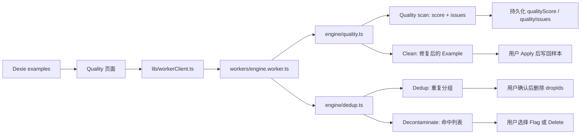

# DataForge 质量工作台：扫描、清洗、去重与基准污染筛查

> 本文档说明 Quality 页四个工具的职责、调用链、结果持久化边界和维护约束。
> 面向维护 Quality 页、Worker 契约或 `engine/quality.ts` / `engine/dedup.ts` 的开发者。
> 样本结构、五种消息角色及 DatasetType 的基础规则见 [数据模型与消息角色规范](./data-model.md)。实现的唯一真相源是源码；本文不替代源码。

**一句话**：Quality 页是用户手动启动的离线质检工作台。它在 Worker 中计算结果；只有 Quality scan、Clean Apply，以及用户确认的 Flag/Delete/Remove 操作会改写 IndexedDB。

---

## 1. 范围、触发时机与数据流

Quality 页由四个相互独立的工具组成：

| 工具 | 目的 | 纯计算入口 | 页面组件 |
|---|---|---|---|
| Quality scan | 结构、内容、模型兼容性与精确重复的质量报告和评分 | `analyzeDataset` / `analyzeExample` | `ScanSection.tsx` |
| Clean | 对已知、可配置的问题进行预览和批量修复 | `cleanExample` | `CleanSection.tsx` |
| Dedup | 查找精确重复和近重复分组 | `exactDuplicates` / `nearDuplicates` | `DedupSection.tsx` |
| Decontaminate | 发现与基准样本的逐字 n-gram 重合 | `decontaminate` | `DecontaminateSection.tsx` |

所有工具均在 `/p/:projectId/quality` 页面由 `src/pages/QualityPage.tsx` 装配。



### 1.1 重要边界：检测不等于写入阻断

- 导入、手动新建、编辑并保存样本时，**不会自动运行** Quality scan，也不会因质量 issue 拒绝保存。
- 消息编辑器会为新增消息建议自然 role 顺序，但 role 仍可手动改动、移动或删除。
- 用户点击每个工具自身的按钮后才触发计算；全部重计算在 Engine Worker 内完成。
- 质检结果是建议和风险信号，不是导出的硬门禁。

### 1.2 结果与持久化边界

| 工具和操作 | 结果 | 是否立即写库 | 可撤销性 |
|---|---|---:|---|
| Quality scan | 每个样本的 `qualityScore`、`qualityIssues`；数据集汇总 | 是 | 扫描不走 undo |
| Clean → Preview | 前 100 条样本的变更统计 | 否 | 不适用 |
| Clean → Apply to all | 发生变更的完整样本 | 是 | `withUndo` |
| Dedup → Find duplicates | exact / near `DuplicateGroup[]` | 否 | 不适用 |
| Dedup → Remove duplicates | 删除每组 `dropIds` 的并集 | 是 | `withUndo` |
| Decontaminate → Run check | `ContaminationHit[]` | 否 | 不适用 |
| Decontaminate → Flag | 将命中样本的 `flagged` 设为 `true` | 是 | `withUndo` |
| Decontaminate → Delete | 删除命中样本 | 是 | `withUndo` |

Quality scan 分块写入 `qualityScore` 与 `qualityIssues`，不写回整个旧行，避免扫描期间覆盖用户编辑；这两个派生字段的写入也不增加样本 `updatedAt`。Clean、Flag 和删除是用户数据变更，会更新相应持久数据。

Dedup 和 Decontaminate 的扫描结果只保留在各自组件的 React 状态中；离开页面或重新运行扫描后，不保证仍可用。

---

## 2. Quality scan

### 2.1 输入、输出与模型模式

`ScanSection` 读取项目的全部 examples，调用 `analyzeExamples(examples, model?)`，再将 index-aligned 报告按每 1,000 条写回。

- **未选目标模型**：Worker 调用 `analyzeDataset()`。除逐样本检查外，还会做数据集级的精确重复检查；上下文溢出检查跳过。
- **已选目标模型**：Worker 对每条样本调用 `analyzeExample({ targetModel })`。上下文窗口和该模型模板的特殊 token 检查启用；**当前路径不执行数据集级精确重复检查**。
- UI 使用已持久化的 `qualityScore` / `qualityIssues` 呈现统计；当前一轮的汇总结果优先显示，直到 live query 追上写入。

### 2.2 规则清单

质检会遍历 `messages`，以及存在时的 `chosen`、`rejected`、`completion`。下面的“对话顺序”仅检查主 prompt `messages`。

| 分类 | IssueType | 严重度 | 判定 |
|---|---|---|---|
| 消息结构 | `missing_role` | critical / high | 单条消息 role 为空；或整个样本没有 user；SFT 没有 assistant。 |
| 消息结构 | `invalid_role` | high | role 不在 `system`、`developer`、`user`、`assistant`、`tool` 中。能映射到 `ROLE_ALIASES` 的别名标记为可自动修复。 |
| 消息结构 | `empty_field` | critical | 样本没有 messages，或消息既无非空 content、reasoning，也无 tool calls。 |
| 对话顺序 | `incoherent_turn_order` | medium / high | assistant 早于第一个 user；连续 `user → user`；或 Preference prompt 的末条不是 user。 |
| 长度 | `too_short` | medium | user / assistant 内容少于 10 字符，纯 tool-call assistant 例外。 |
| 长度 | `too_long` | high | user / assistant 内容超过 32,000 字符。 |
| 长度 | `imbalanced_ratio` | medium / low | 非 RL 样本中，assistant:user 内容长度比低于 0.1 或高于 50。 |
| 回答模式 | `refusal_pattern` | high | assistant 内容命中已知拒答开头；`rejected` continuation 不检查，因为拒答可构成有效的偏好负样本。 |
| 隐私 | `pii_detected` | high | content 或 reasoning 中包含邮箱、SSN、银行卡号、IP 地址或电话号码。 |
| 编码 | `encoding_error` | medium | 检测到 mojibake 特征、替换字符、null byte 或字节转义异常。 |
| 模板兼容 | `special_token_conflict` | medium / high | content 或 reasoning 含 chat template 控制 token。目标模型存在时只检查该模板家族，并使用 high；否则检查全部已知 token，严重度为 medium。 |
| 工具调用 | `malformed_tool_call` | high | assistant tool call 的 `arguments` 非 JSON，或 tool 消息缺少 `toolCallId`。 |
| 工具调用 | `orphan_tool_result` | high | tool 消息的 `toolCallId` 未引用此前 assistant 声明过的 call id。 |
| 类型字段 | `empty_field` | critical | Preference 缺非空 `chosen` / `rejected`；KTO 缺非空 `completion` 或布尔 `label`；RL 缺非空 `answer`。 |
| 模型兼容 | `context_overflow` | critical | 仅目标模型已选时，样本 token 数超过 `ModelInfo.recommendedSeqLen`。 |
| 数据集级 | `duplicate` | high | 仅 `analyzeDataset()` 路径：后出现的样本与先前样本的规范化全量签名相同。 |

**不是严格的“两条消息一问一答”校验。** 系统支持多轮对话、`system` / `developer`、以及 `assistant(toolCalls) → tool → assistant` 轨迹。当前顺序规则显式报告连续 user 和 assistant 早于 user；它不单独把连续 assistant 设为 issue。

### 2.3 `qualityScore` 的组成

每条样本得到 0–100 的分数，分量为：

- `completeness`：样本类型要求的 user、assistant / continuation / label / answer 是否完整；
- `formatting`：格式化相关的质量信号；
- `lengthBalance`：问答长度比例及总体有效长度；
- `contentQuality`：medium、low issue 的惩罚。

样本存在 issue 或长度不平衡时，权重为 completeness 0.20、formatting 0.20、lengthBalance 0.35、contentQuality 0.25；无 issue 且平衡时四项等权。分数用于排序和人工审阅，不替代对训练目标的人工判断。

### 2.4 精确重复的 scan 实现

Quality scan 的精确重复只在未选择目标模型时发生。其签名包含：

- 样本类型；
- 所有消息列表中的 role、content、reasoning、tool call payload；
- RL `answer` 与 KTO `label`。

签名忽略文本大小写和连续空白。第一条出现的样本保留，后续相同样本各得到一个 `duplicate` issue。它与 Dedup 的 exact 算法不同：Dedup 只比较可训练文本，而 scan 的签名还纳入 role、数据集类型和部分结构化字段。

---

## 3. Clean

Clean 是可配置的修复流水线，不会运行 Quality scan 的所有规则，也不会自动补造缺失的训练语义。

| CleaningOptions | UI 文案 | 行为 |
|---|---|---|
| `removeEmptyMessages` | Remove empty messages | 移除没有 content、reasoning 或 tool calls 的消息。 |
| `normalizeRoles` | Normalize roles | 将 `human`、`gpt` 等已知别名归一为规范 role。 |
| `fixEncoding` | Fix encoding | 修复已知 mojibake，并移除 null byte。 |
| `normalizeWhitespace` | Normalize whitespace | 压缩过量空行、移除行尾空白、裁剪边界空白。 |
| `removeRefusals` | Remove refusals | 从 assistant 内容移除已知拒答开头及其所在句的剩余部分。 |
| `maskPii` | Mask PII | 将邮箱、电话、SSN、银行卡和 IP 替换为占位符。 |
| `removeSpecialTokens` | Remove special tokens | 从消息文本移除已知 chat template 控制 token。 |

`DEFAULT_CLEANING` 定义在 `src/engine/types.ts`，是默认勾选状态的唯一真相源。不要在文档或 UI 另行复制默认值。

- **Preview**：只读取项目的前 100 条，显示会改变的样本数量和总变更数，不写库。
- **Apply to all**：读取所有项目样本，在 Worker 中以 1,000 条为一批清洗，只将有变更的样本批量写回；整体操作包在 `withUndo` 中。
- 清洗不能可靠修复的事项包括：缺少 assistant 回答、错误的业务事实、连续 user、Preference prompt 尾部错误、孤立工具调用的正确关联等。这些应由人工编辑或专门业务规则处理。

---

## 4. Dedup

Dedup 是独立的重复分组工具，不会给样本写入 `qualityIssues` 或 `qualityScore`。结果仅在用户确认删除时改写数据。

### 4.1 共同文本基础

精确重复、近重复和基准污染筛查都从如下内容拼接得到比较文本：`messages`、`chosen`、`rejected`、`completion` 中的 content、reasoning 和 tool-call arguments。

因此，prompt 相同但 chosen continuation 不同的两个 Preference 样本不被视为重复。

### 4.2 精确重复

`exactDuplicates()` 将比较文本转为小写、压缩连续空白并裁剪边界，再进行 FNV-1a hash 分桶和桶内原文确认。空文本样本跳过：它们属于 `empty_field` 问题，而不是重复。

- 算法复杂度：$O(\text{total text length})$。
- 每一组保留输入序最早的样本为 `keepId`，其余顺序放入 `dropIds`。
- hash 碰撞会进行桶内字符串确认，不会将碰撞误报为重复。

### 4.3 近重复

`nearDuplicates()` 的步骤为：

1. 截取每个样本规范化文本的前约 2,000 字符；
2. 构建 3-word shingles；
3. 计算 128-permutation MinHash 签名；
4. 用 $16 \times 8$ LSH banding 召回候选；
5. 对候选用精确 Jaccard 相似度验证；
6. 将通过阈值的边合并为 group。

默认验证阈值为 0.85。UI 允许 0.70–0.95、步长 0.05；每组的 `similarity` 是连接该 group 的边中最小验证相似度，属于保守下界。

### 4.4 删除语义与展示边界

- UI 合并 exact 和 near groups，并对所有 `dropIds` 去重后删除；同一样本不会被重复删除。
- 删除操作可 undo。
- UI 最多展示 50 个 group，预览仅显示首条 user（无 user 时首条消息）的前 80 字符。展示截断不影响算法比较范围。

---

## 5. Decontaminate

Decontaminate 用于发现训练数据与公开 benchmark 测试样本的逐字重合风险。它是泄漏筛查，不是语义相似度检索，也不能独自证明数据来源。

### 5.1 输入和归一化

用户可以选择 `BUILTIN_BENCHMARK_SAMPLES` 中的内置基准，或加载 / 粘贴一行一条的自定义列表。样本和 benchmark 都会：

1. 转小写；
2. 移除标点等非 Unicode 字母数字字符；
3. 分割为 words。

### 5.2 匹配规则

- 默认窗口为连续 **13 个词**，`DECONTAMINATION_NGRAM_SIZE = 13`。
- 长度至少 13 词的 benchmark item 会索引全部滑动 13-grams。
- 较短但至少 5 词的 benchmark item 整体作为一个较短窗口；少于 5 词的 item 跳过，以降低误报。
- 每个 example 至多返回一条 hit：优先更长窗口，返回第一个匹配的规范化 n-gram。
- 返回值为 `{ exampleId, benchmarkName, matchedNgram }`。

### 5.3 后续动作

| 操作 | 持久化结果 | 适用场景 |
|---|---|---|
| Flag | `Example.flagged = true` | 需要人工确认，或可接受但需在导出前审查。 |
| Delete | 删除命中 Example | 已确认不得进入训练集。 |

两项操作均可 undo。UI 最多显示 100 条命中；该上限仅影响显示，不影响扫描。

---

## 6. 推荐工作顺序

```text
Quality scan
→ Clean Preview
→ Clean Apply
→ 再次 Quality scan
→ Dedup
→ Decontaminate
→ 人工审查高严重度、低分和 flagged 样本
→ Export
```

原因：Clean 会改变比较文本和质量信号，故应在清洗后重新扫描并重新查重；删除重复或污染项后，应再次确认项目样本量、split 分布和导出预估。

---

## 7. 源码职责与调用链

| 职责 | 文件 |
|---|---|
| 页面组装 | `src/pages/QualityPage.tsx` |
| Scan UI、批量写回与汇总展示 | `src/components/quality/ScanSection.tsx` |
| Clean UI、preview 与 apply | `src/components/quality/CleanSection.tsx` |
| Dedup UI、候选删除 | `src/components/quality/DedupSection.tsx` |
| Decontaminate UI、flag / delete | `src/components/quality/DecontaminateSection.tsx` |
| Worker API 契约及调用包装 | `src/lib/workerClient.ts` |
| Comlink Worker 适配 | `src/workers/engine.worker.ts` |
| 质量扫描、评分和清洗纯逻辑 | `src/engine/quality.ts` |
| 精确/近重复与污染筛查纯逻辑 | `src/engine/dedup.ts` |
| `IssueType`、`QualityIssue`、`CleaningOptions` 真相源 | `src/engine/types.ts` |
| Flag、删除、普通更新 mutation | `src/lib/mutations.ts` |
| 可撤销批量变更 | `src/lib/undo.ts` |

`src/engine/` 及 `src/workers/engine.worker.ts` 必须保持无 DOM、无 React、无运行时副作用；它们同时是浏览器 Worker 和 Vitest Node 环境的执行边界。

---

## 8. 维护检查清单

### 新增或修改 Quality scan issue

1. 更新 `src/engine/types.ts` 中的 `IssueType`（唯一类型真相源）。
2. 在 `src/engine/quality.ts` 定义触发条件、严重度、`autoFixable`、字段定位及分数影响。
3. 若 UI 没有活跃 issue 以供推导严重度，更新 `ScanSection.tsx` 的 `FALLBACK_SEVERITY`。
4. 为正常、边界和错误路径更新 `src/engine/quality.test.ts`。
5. 更新本文件的规则清单；若涉及样本结构约束，同时更新 `data-model.md`。

### 新增或修改清洗操作

1. 同步 `CleaningOptions`、`DEFAULT_CLEANING`、`cleanExample()` 与 Clean UI 的 `CLEANING_FIELDS`。
2. 明确该操作是否有破坏性、是否应默认启用、是否可安全重复执行。
3. 为 Preview 与 Apply 共享的 engine 行为添加或更新测试。
4. 更新本文件的操作表与安全边界。

### 修改重复或污染算法

1. 说明算法输入的字段、归一化方法、阈值和结果的稳定顺序。
2. 确认 exact、near、decontaminate 的结果不会被误写成 `qualityIssues`。
3. 更新 `src/engine/dedup.test.ts`，至少覆盖阈值边界、空文本、偏好样本 continuation 差异和稳定 keep/drop 选择。
4. 若改动 UI 限制（展示条数、阈值滑块、操作行为），同步本文件。

### 修改 Worker 边界或存储写入

1. 保持 `EngineWorkerApi`、`engine.worker.ts` 和 `workerClient.ts` 的方法签名一致。
2. Scan 写回必须继续使用部分字段更新，避免覆盖扫描期间的用户编辑。
3. 删除和 flag 等用户可见变更必须继续通过 `withUndo`；不要把扫描结果的临时状态持久化为未经确认的删除/flag 决策。
4. 运行相关的 engine/lib 测试；UI 交互变更通过浏览器验证实际页面。

---

## 9. 测试定位

| 变更面 | 首要测试 |
|---|---|
| Quality scan、评分、清洗 | `src/engine/quality.test.ts` |
| 精确重复、近重复、基准污染 | `src/engine/dedup.test.ts` |
| Worker API 适配 | 通过对应 engine 纯逻辑测试；Worker 只做 Comlink 适配 |
| Quality 页交互 | 浏览器驱动实际 Quality 页面；项目当前不维护组件测试 |

修改纯逻辑时，新增测试必须覆盖新的可观察行为或可回归边界，而不是仅断言实现细节。